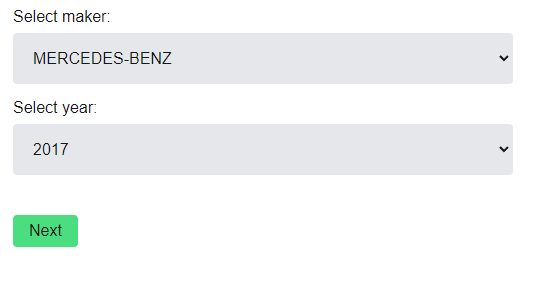
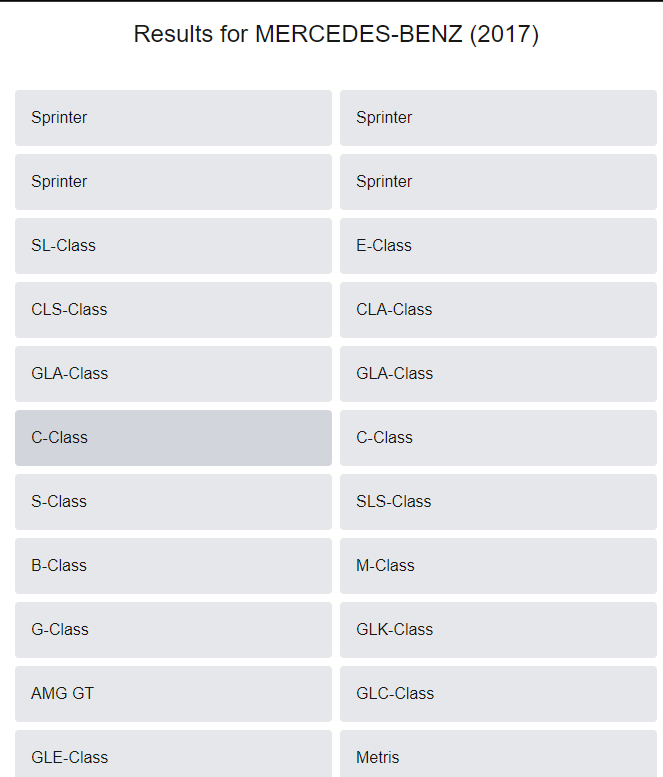

# Test task for Develops.Today (by Serhii Kozlov)

### Description
A car dealership website, that allows users to view available models and filter them based on manufacturer and year. 

Created with React + Next.js + Tailwind CSS. Also uses React Suspense.

Utilizes [vPIC vehicle API](https://vpic.nhtsa.dot.gov/api/?ref=public_apis) as a source of data.

### How to run 
To run locally: `npm run dev`
To build: `npm run build`

### **Screenshots**
 - Home Page
  

 - Results Page
  